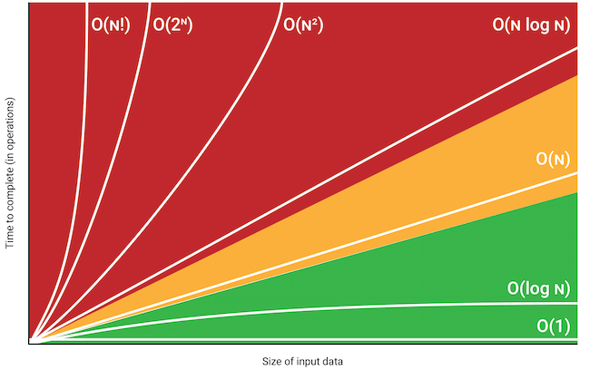

Hello! 👋

As **performance** and **reliability** is more and more important in software development, it is important to know how to write **efficient code**, and also learn to **not rely on every possible dependency of the world**, when it is not worth it.

The more dependencies we add to our projects, the greater the complexity and maintenance overhead becomes. Each additional dependency requires understanding its functionality, <abbr title="Application Programming Interface">API</abbr>, and potential conflicts with other dependencies. This complexity makes the codebase harder to maintain, and it also poses significant security risks.

We don't want to "reinvent the wheel" and rewrite everything from scratch for each project. In fact, you are **always depending on something** when you are writing your software. At the very least, you are dependent on the programming language you are using. Even if you are doing very low-level stuff, you are still depending on something: hardware.

However, it is important to draw a line between what dependencies are worth the cost and which are not.

Most likely adding a [JavaScript npm package `is-odd`](https://www.npmjs.com/package/is-odd) to check if a number is odd or even for example, is not worth it. Writing it ourselves is easier and allows a better maintenance in the long term.

Learning **how to solve problems** and how to write efficient code is very important and also a very broad and complicated topic, so this blog post will only be an **introduction to the subject**, and will not go in depth.

**Note:** Sources used to write this blog post are available at the [end of this post](#sources).

## What is Competitive Programming?

**Competitive programming** consists of solving correctly and efficiently **well-defined problems** by writing **computer programs** under specified **constraints**. Typically a solution to a problem is a combination of well-known techniques and new insights.

There are many famous competitions: [Google Code Jam](https://codingcompetitions.withgoogle.com/codejam), [Facebook Hacker Cup](https://www.facebook.com/codingcompetitions/hacker-cup), [International Olympiad in Informatics](https://ioinformatics.org/), [International Collegiate Programming Contest](https://icpc.global/), [LeetCode](https://leetcode.com/), [CodinGame](https://www.codingame.com/), etc.

The most common programming languages used for Competitive Programming are: **C++**, **Python** and **Java**. However the design of the algorithms and data structures are applicable to **any programming language**.

All examples solutions on this blog post will be done in **Python**.

## Topics to explore/learn with Competitive Programming

- Time/Space complexity and Big O Notation

- Sorting: Sorting algorithms and Binary search

- Data structures: Arrays (1D, 2D: Matrix, 3D, Multidimensional), Dictionaries, Linked lists, Stack, Queue, Trees, Graphs, Heaps, etc.

- Complete search: Generating Subsets, Permutations, Combinations, etc.

- Greedy algorithms: Coin problem, Scheduling, Minimizing sums, etc.

- Dynamic programming: Fibonacci, Coin problem, Knapsack, etc.

- Bit manipulation: Bit representation, Bit operations, etc.

- Shortest path: Dijkstra, Bellman-Ford, Floyd-Warshall, etc.

- String: Trie structure, String hashing, Z-algorithm, etc.

You can see there are lot of concepts to learn and explore, and it is not an exhaustive list. On this blog post, we will only see the first topic: **Time/Space complexity and Big O Notation**.

## Time/Space complexity and Big O Notation

### Definition

An Algorithm is a finite sequence of well-defined instructions, that have to be given to the computer to perform a specific task. In this context, the variation can occur the way how the instructions are defined. There can be **any number of ways**, a specific set of instructions can be defined **to perform the same task**. Also, with options available to choose any one of the available programming languages, the instructions can take any form of syntax along with the performance boundaries of the chosen programming language. We also indicated the algorithm to be performed in a computer, which leads to the next variation, in terms of the operating system, processor, hardware, etc. that are used, which can also influence the way an algorithm can be performed.

Different factors can influence the outcome of an algorithm being executed, it is wise to understand how efficiently such programs are used to perform a task. To gauge this, we require to evaluate:

- The **Space complexity** of an algorithm **quantifies** the amount of **space or memory taken** by an algorithm to run based on the size of the input.
- The **Time complexity** of an algorithm **quantifies** the amount of **time taken** by an algorithm to run based on the size of the input.

We more often talk about the **time complexity** than space complexity of an algorithm, because we can reuse memory unlike time and memory is cheap nowadays.

**Big O Notation** describes the complexity of an algorithm in terms of **how quickly it grows relative to the input size $n$ (e.g: length of the string, size of the array etc.)** by defining the $N$ number of operations that are done on it.
Example of Big O notation: $O(n^2)$.

### Time complexity

Time complexity **measures** the **time taken** **to execute each statement** of code in an algorithm. It is not going to examine the total execution time of an algorithm. Rather, it is going to give information about the variation (increase or decrease) in execution time when the number of operations (increase or decrease) in an algorithm.

There are many rules to calculate the time complexity of an algorithm.

#### Loops

A common reason why an algorithm is slow is that it contains many loops that go through the input. The more nested loops the algorithm contains, the slower it will run.

If there are $k$ nested loops, the time complexity of the algorithm will be $O(n^k)$.

##### Example $O(n)$

```python
for iteration in range(n):
    pass

# or with a while loop
iteration = 0
while iteration < n:
    pass
```

##### Example $O(n^2)$

```python
for iteration in range(n):
    for iteration2 in range(n):
        pass
```

##### Example $O(n^3)$

```python
for iteration in range(n):
    for iteration2 in range(n):
        for iteration3 in range(n):
            pass
```

etc.

#### Order of magnitude

A time complexity does not tell us the exact number of times the code inside a loop is executed, but it only shows the **order of magnitude**.

In the following examples, the time complexity of the algorithms is $O(n)$ but the number of operations is different.

##### Example 1

```python
for iteration in range(0, n * 3, 1):
    pass
```

Number of operations: $3n$

##### Example 2

```python
for iteration in range(0, n + 5, 1):
    pass
```

Number of operations: $n + 5$

##### Example 3

```python
for iteration in range(0, n, 2):
    pass
```

Number of operations: ${n \over 2}$

#### Phases

If the algorithms consists of consecutive phases, the total time complexity is the largest time complexity of a single phase because it is usually the bottleneck of the code.

The following code consists of 3 phases, with time complexities $O(n)$, $O(n^2)$ and $O(n)$. Thus the total time complexity is $O(n^2)$.

```python
for iteration in range(n):
    pass

for iteration in range(n):
    for iteration2 in range(n):
        pass

for iteration in range(n):
    pass
```

#### Several variables

Sometimes the time complexity depends on several factors. In this case, the time complexity formula contains several variables: $O(nm)$.

```python
for iteration in range(n):
    for iteration2 in range(m):
        pass
```

#### Recursion

The time complexity of a recursive function depends on the number of times it is called and the time complexity of a single call. The total time complexity is the product of these values.

##### Example 1

The call `recursive(n)` causes $n$ calls and the time complexity of each call is $O(1)$. Thus the total time complexity is $O(n)$.

```python
def recursive(n: int):
    if n != 1:
        recursive(n - 1)
```

##### Example 2

```python
def recursive(n: int):
    if n != 1:
        recursive(n - 1)
        recursive(n - 1)
```

In this case, `recursive(n)` causes 2 other calls except for $n = 1$.

The following table shows the function calls produced by this single call:

| function call | number of calls |
| ------------- | --------------- |
| $g(n)$        | $1$             |
| $g(n - 1)$    | $2$             |
| $g(n - 2)$    | $4$             |
| ...           | ...             |
| $g(1)$        | $2^{n - 1}$     |

Based on this, the time complexity is:

$$
1 + 2 + 4 + ... + 2^{n - 1} = 2^n - 1 = O(2^n)
$$

#### Complexity Classes (from fastest to slowest)



Here is a list of classes of functions that are commonly encountered when analyzing the running time of an algorithm.

- $O(1)$: **Constant** (does not depend on the input size). A typical constant-time algorithm is a direct formula that calculates the answer.

- $O(\log_2(n))$: **Logarithmic** algorithm often halves the input size at each step. $\log_2(n)$ equals the number of times $n$ must be divided by 2 to get 1.

- $O(\sqrt{n})$: **Square root** algorithm is slower than $O(\log_2(n))$ but faster than $O(n)$.

- $O(n)$: **Linear** algorithm goes through the input a constant number of times. This is often the best possible time complexity, because it is usually necessary to access each input element at least once before reporting the answer.

- $O(n \log_2(n))$: **Log linear** often indicates that the algorithm sorts the input, because the time complexity of efficient sorting algorithms is $O(n \log_2(n))$. Another possibility is that the algorithm uses a data structure where each operation takes $O(\log_2(n))$ time.

- $O(n^2)$: **Quadratic** algorithm often contains 2 nested loops. It is possible to go trough all pairs of the input elements in $O(n^2)$ time.

- $O(n^3)$: **Cubic** algorithm often contains 3 nested loops. It is possible to go trough all triplets of the input elements in $O(n^3)$ time.

- $O(2^n)$: **Exponential** often indicates that the algorithm iterates through all subsets of the input elements. For example, the subsets of $\{1, 2, 3\}$ are $S = \{\{\empty\}, \{1\}, \{2\}, \{3\}, \{1, 2\}, \{1, 3\}, \{2, 3\}, \{1, 2, 3\} \}$.

- $O(n!)$: **Factorial** often indicates that the algorithm iterates through all permutations of the input elements. For example, the permutations of $\{1, 2, 3\}$ are $P = \{\{1, 2, 3\}, \{1, 3, 2\}, \{2, 1, 3\}, \{2, 3, 1\}, \{3, 1, 2\}, \{3, 2, 1\} \}$.

### Estimating efficiency

By checking the time complexity of an algorithm, it is possible to check before implementing the algorithm,that it is efficient enough for the problem.

Example: assume that the time limit for a problem is 1 second and the input size is $n = 10^5$. If the time complexity is $O(n^2)$, the algorithm will perform about $(10^5)^2 = 10^{10}$ operations.

Given that a modern computer can perform some hundred of millions of operations per second. This should take at least 10 seconds, so the algorithm seems to be too slow for solving the problem.

## Practical problem: Maximum subarray sum

There are often several possible algorithms for solving a problem such that their time complexities are different. This section discusses a classic problem that can be solved using several different algorithmic techniques, including brute force, divide and conquer, dynamic programming, and reduction to shortest paths, each technique with different time complexity.

**Maximum subarray sum**: Given an array of $n$ integers, find the contiguous subarray with the largest sum.

Contiguous subarray is any sub series of elements in a given array that are contiguous ie their indices are continuous. The problem is interesting when there may be negative values in the array, because if the array only contains positive values, the maximum subarray sum is basically the sum of the array (the subarray being the complete array).

### Example 1

#### Input

```txt
[1, 2, 3, 4, 5, 6]
```

#### Output

```txt
21
```

**Explanation:** The subarray with the largest sum is the array itself (as there is no negative values) `[1, 2, 3, 4, 5, 6]` which has a sum of `21`.

### Example 2

#### Input

```txt
[-1, 2, 4, -3, 5, 2, -5, 2]
```

#### Output

```txt
10
```

**Explanation:** The subarray with the largest sum is `[2, 4, -3, 5, 2]` which has a sum of `10`.

### Worst solution: Brute force

```python
def maximum_subarray_sum_cubic(array: list[int]) -> int:
    """
    Time complexity: O((array_length)^3)

    We go through all possible subarrays, calculate the sum in each subarray and maintain the maximum sum.
    """
    if len(array) == 0:
        return 0
    best_sum = array[0]
    length = len(array)
    for i in range(length):
        for j in range(i, length):
            sum = 0
            for k in range(i, j + 1):
                sum += array[k]
            if sum > best_sum:
                best_sum = sum
    return best_sum
```

### Better solution: Linear time

```python
def maximum_subarray_sum_linear(array: list[int]) -> int:
    """
    Time complexity: O(array_length)

    We loop through the array and for each array position, we calculate the maximum sum of a subarray that ends at that position. After this, the answer for the problem is the maximum of those sums.
    """
    if len(array) == 0:
        return 0
    best_sum = array[0]
    length = len(array)
    sum = 0
    for i in range(length):
        sum = max(array[i], sum + array[i])
        best_sum = max(best_sum, sum)
    return best_sum
```

## Conclusion

Problems solving is a very complicated and large topic, and also a very important skill to have as a software developer.

To improve our problems solving skills, we can regularly practice with [programming challenges](https://github.com/Divlo/programming-challenges).

## Sources

- [Wikipedia - Competitive programming](https://en.wikipedia.org/wiki/Competitive_programming)
- [Frontend Masters - The Last Algorithms Course You'll Need](https://frontendmasters.com/courses/algorithms/)
- [Big-O Cheat Sheet](https://www.bigocheatsheet.com/)
- [programming challenges](https://github.com/Divlo/programming-challenges)
