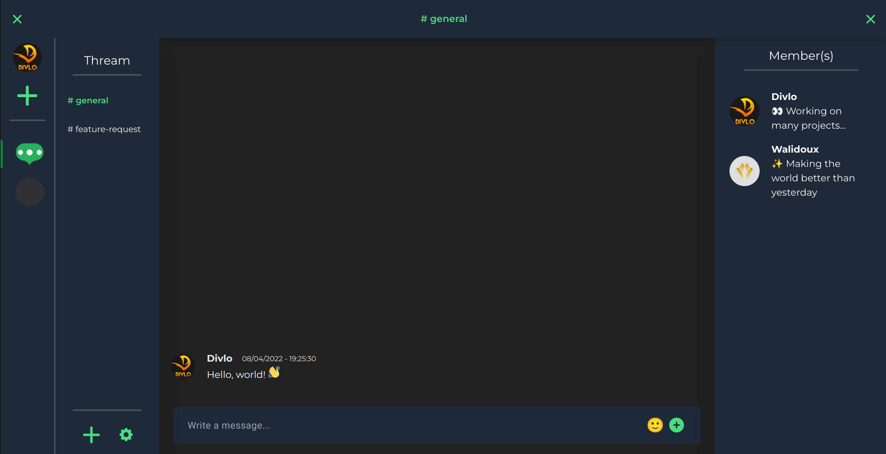
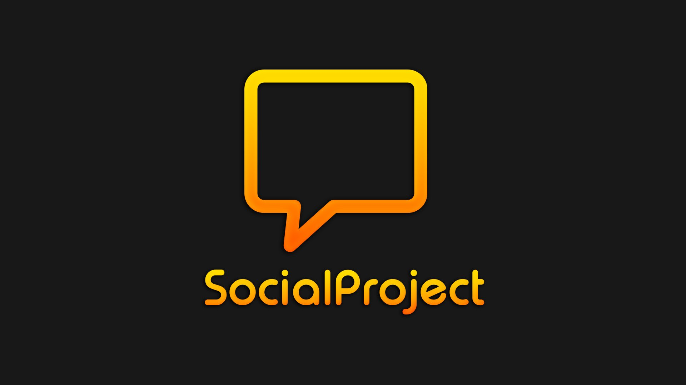
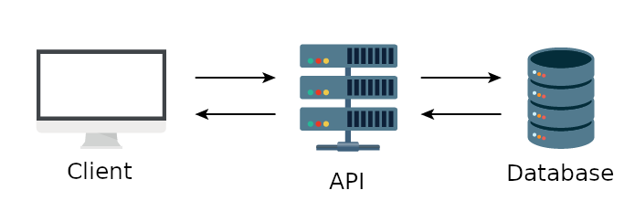

Hello! 👋

After months of hard work, [Thream v1.0.0](https://thream.divlo.fr/) has been released! 🎉

[**Thream**](https://thream.divlo.fr/) is your open-source platform to stay close with your friends and communities, talk, chat, collaborate, share and have fun.

## Presentation

[**Thream**](https://thream.divlo.fr/) is a social network to stay close with your friends and communities to talk, chat, collaborate and share.

The project is largely inspired by [Discord](https://discord.com), a proprietary instant messaging service, but differentiates itself by its **non-profit open source philosophy** and will integrate special features.

The source code is available on [GitHub](https://github.com/Thream).

The idea is that a user can create an account to authenticate with an email address, and a password, or directly use an account from another platform (currently supported: Google, GitHub, Discord). Once the user is authenticated, he/she can create and join "guilds", in other words communities, in order to discuss with other people in several channels to group discussions talking about the same subject.

[**Thream**](https://thream.divlo.fr/) is a website that works on any recent browser, accessible on [thream.divlo.fr](https://thream.divlo.fr/).

## History

The idea for the project has existed since May 13, 2020, symbolized by a [publication on Twitter](https://twitter.com/theoludwig_/status/1260638175246135296) by the creator: Théo LUDWIG.

The main goal is to put into **practice knowledge in web development** and computer science in general on a concrete project that can **easily evolve over time** where you can add many features.

The development of the project begins under the name of **SocialProject**, on August 20, 2020, with colors close to the image of Divlo.

When I started the project, I had little knowledge of database design, real-time management or the architecture of such a large <abbr title="Information Technology">IT</abbr> project, so this will be accompanied by many technical problems, to which we will need to find appropriate solutions.

On October 19, 2020, **SocialProject** becomes **Thream**, an invented name, not yet used and more original than the previous one, and also changes colors so that the application is accessible in two distinct themes (light and dark).

With the help of [Walidoux](https://github.com/Walidoux), a junior developer really good at making beautiful <abbr title="User Interface">UI</abbr> with <abbr title="Cascading Style Sheets">CSS</abbr>, we were able to collaborate on this side project together.

Since the project is mainly developed during free time (mainly on weekends), the project took longer to be developed than desired, but now we finally released the first version. 🥳

## Implementation and Technical Difficulties

### Architecture

**Thream** is divided into two distinct projects:

- The **server** part, called **backend**, which the user does not see, allows actions to be taken to save or recover data in the **database**, it is the technical and functional aspect of the project. This part uses a style of software architecture defining a set of constraints to be used to create web services that establish interoperability between computers on the Internet, called REST <abbr title="Application Programming Interface">API</abbr>.

- The **client** part, called **frontend**, what **the user sees on the screen**, such as forms, buttons and all the **graphic elements** with which the user can interact from a browser.

This design allows the separation between the client and the server, as long as they both structure their communication according to the <abbr title="Representational state transfer">REST</abbr> architectural guidelines, using the <abbr title="Hypertext Transfer Protocol">HTTP</abbr> protocol, they will be able to communicate with each other, which makes it possible to work independently on the backend and on the frontend using different technologies and skills, really useful in teamwork.

To allow the development of this design, it is necessary to think about its architecture in order to solve the following problem: how to store and structure the folders and files of a source code in order to find which file to modify to correct a problem with a particular feature, or to add a feature?

There are two main architectures to solve this problem:

- The **Monorepo** architecture is a single directory containing several distinct projects with well-defined relationships, i.e. it allows the modification of the code in the client and server part simultaneously in the same place by verifying that a modification in the server part does not impact the client part.
- The **Polyrepo** architecture are several directories, a directory corresponding to a project.

Both architectures track source code file history using version control systems such as [git](https://git-scm.com/).

**Thream**, uses the **Polyrepo** architecture, to make it easier to set up and allows complete independence between client and server code.

### Technologies

Now that we have discussed, on the architecture of the source code, we will discuss the choice of technologies. The chosen technologies must meet the need, and allow the developer to be productive to quickly have a result. Often there are several possible technologies to meet the same need, so it is a question of choosing the technology that you prefer and that you know best.

To ease the development, we chose for **Thream** to use the [TypeScript](https://www.typescriptlang.org/), an open source programming language made by Microsoft. It's a stricter syntactic superset of **JavaScript**, and adds optional static typing to the language, meaning we can assign a "type" (`string`, `number`, `boolean` etc.) to each data/variable in the code, which has the advantage of identifying program errors even before execution and thus greatly improves developer productivity.

The **TypeScript** code is then compiled into **JavaScript** language which is one of the basic technologies of the **World Wide Web**, alongside HTML and CSS (in the client part), this makes it possible to make the pages of websites **interactive** by executing code depending on a certain event, for example when clicking on a button, or when pressing a key on the keyboard.

Since the creation of **Node.js** in 2009, it is now also possible to execute **JavaScript** outside the browser, for example on a server. **Node.js is a runtime environment** that offers modules that handle various basic features for interacting with files/folders, networking (DNS, HTTP, TCP, TLS/SSL, or UDP), and other functions inaccessible from a browser and designed to reduce the complexity of developing server applications.

**TypeScript** allows you to code with the same programming language, the client part and the server part, with different needs.

### User Interface (frontend)

The needs of the graphical interface (the client part):

- be accessible through a web browser
- allow the user to install the application
- adapts to screen size
- real-time data update (example: when a new message is sent)
- save the authenticated user (in cookie)

In order to meet its needs, Thream is a **<abbr title="Progressive Web App">PWA</abbr>**, this consists of making a website appear to the user as a native application, which makes it possible to combine the functionalities of browsers with those of the experience offered by native applications, such as the possibility of installing the application. The main advantage is to be able to **code once** and to provide the **application on several platforms (iOS, Android, Windows, GNU/Linux etc.)** without the need to develop specifically according to each platform.

To design a **<abbr title="Progressive Web App">PWA</abbr>**, and allow updating the data on the graphical interface, we can use a framework, a development infrastructure to offer us a set of tools and software components. For **Thream**, we use [Next.js](https://nextjs.org/), a framework based on [React.js](https://reactjs.org/), which allows you to create interactive user interfaces in JavaScript, to **update the graphical interface when the data changes**.

### Server (backend)

By using the protocol, **<abbr title="Hypertext Transfer Protocol">HTTP</abbr>**, it is the client who sends a request to the server, but to allow the transfer of data in real time, the **<abbr title="Hypertext Transfer Protocol">HTTP</abbr>** protocol is no longer sufficient.

We use **WebSockets** so that it is the server that send a response to all connected clients without the client requesting to the server to get a response, the server sends responses according to events, for example when creating or deleting a message.

Thanks to [Fastify](https://www.fastify.io/), a fast and low overhead web framework, for Node.js and [Socket.io](https://socket.io/), a bidirectional and low-latency communication for every platform, we can easily make REST API and real time communication.

To store the data, we use [PostgreSQL](https://www.postgresql.org/) database, and [Prisma](https://www.prisma.io/), a <abbr title="Object-Relational Mapping">ORM</abbr> for Node.js, which allows us to easily interact with the database without the need of writing <abbr title="Structured Query Language">SQL</abbr> ourselves.

## Current and future state

The main interest of **Thream** is to be able to put into practice the computer knowledge acquired as an autodidact on a concrete project, in order to learn, and understand the problems and potential solutions to complex computer applications such as social networks.

Now that the first version of **Thream** has been released, there may not be any major evolution thereafter, the project will continue to be maintained to fix any bugs, and remain accessible, for as long as possible.

The other interest of the project is that it is completely **open-source**, and allows those who want to contribute to the development, and add new features.

**Thream** is **non-profit** and therefore has no financial goal, deadline or specific feature target, which makes the design of the project a hobby and a way to learn new concepts.

Feel free to give feebacks and suggestions to improve the project, and to report any bug you find.

**Thream** is available: [**thream.divlo.fr**](https://thream.divlo.fr/).
